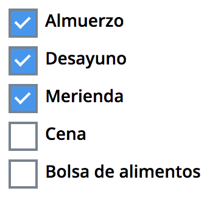

# checkbox-list-react

> 

[](https://www.npmjs.com/package/react-checkboxes) [](https://standardjs.com)

## Implementation
1. Install
```
npm install --save checkbox-list-react
```

2. Import
```
import CheckBoxes from 'checkbox-list-react'
```

3. Data input
```
list = []
```
```
inputs = {
  lunch: 'Almuerzo',
  breakfast: 'Desayuno',
  snack: 'Merienda',
  dinner: 'Cena',
  foodBag: 'Bolsa de alimentos'
}
```

4. Example Usage

```
export default class CheckboxContainer extends Component {
  constructor () {
    super()

    this.state = {
        data: {

        }
    }
  }

  onChange = e => {
    const { data } = this.state

    this.setState({
      data: {
        ...data,
        [e.target.name]: e.target.value
      }
    })
  }

  render() {
    return(
      <div>
        <CheckBoxes list={list} inputs={inputs} onChange={this.onChange} name="food"/>
      </div>
    )
  }
}
```
5. What should be rendered 

- [ ] Almuerzo
- [ ] Desayuno
- [ ] Merienda
- [ ] Cena
- [ ] Bolsa de alimentos

6. Output when checked

- [x] Almuerzo
- [x] Desayuno
- [ ] Merienda
- [ ] Cena
- [ ] Bolsa de alimentos

```
e.target.value = ['lunch', 'breakfast']
```

## Optional styling

```
.custom-checkbox {
  font-family: 'Open Sans', sans-serif;
  font-weight: 600;
  display: block;
  position: relative;
  padding-left: 30px;
  margin-bottom: 12px;
  cursor: pointer;
  font-size: 14px;
  -webkit-user-select: none;
  -moz-user-select: none;
  -ms-user-select: none;
  user-select: none;
}

.custom-checkbox input {
  position: absolute;
  opacity: 0;
  cursor: pointer;
  height: 0;
  width: 0;
}

.checkmark {
  position: absolute;
  top: 0;
  left: 0;
  height: 20px;
  width: 20px;
  border: 2px solid #76838f;
  background-color: transparent;
}

.custom-checkbox input:checked ~ .checkmark {
  background-color: #2196f3;
}

.custom-checkbox:after {
  content: '';
  position: absolute;
  display: none;
}

.custom-checkbox input:checked ~ .checkmark:after {
  display: block;
}

.custom-checkbox .checkmark:after {
  content: '';
  position: relative;
  left: 6px;
  top: 2px;
  width: 5px;
  height: 10px;
  border: solid white;
  border-width: 0 2px 2px 0;
  -webkit-transform: rotate(45deg);
  -ms-transform: rotate(45deg);
  transform: rotate(45deg);
  display: none;
}

```

## License

MIT © [puribey](https://github.com/puribey)
